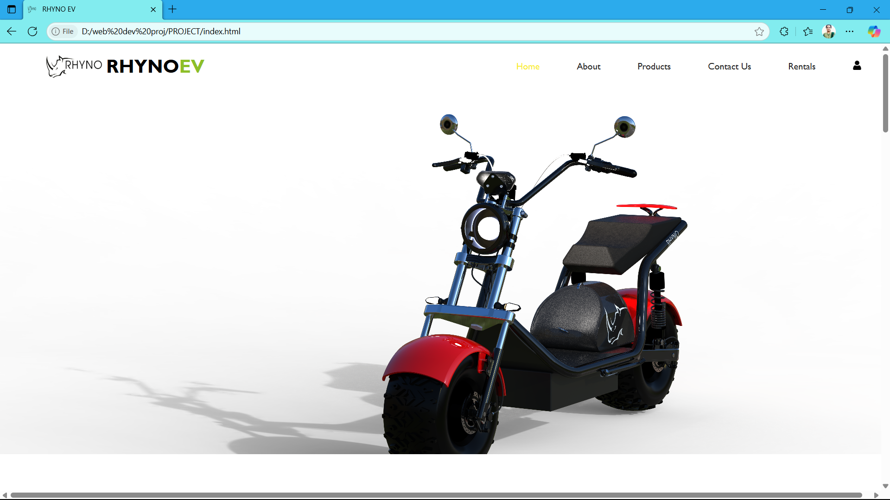

# Rhyno EV Website


*Home page of Rhyno EV Website*


*Responsive design on mobile device*

A modern, responsive website for Rhyno Electric Vehicles, designed to showcase products, provide rental information, and facilitate user interaction.

<<<<<<< HEAD

*Home page of Rhyno EV Website*


A modern, responsive website for Rhyno Electric Vehicles, designed to showcase products, provide rental information, and facilitate user interaction.
=======
>>>>>>> 04f3020 (Add homepage and responsive screenshots, update README with images)
## 🚗 Project Overview
This project is a static website for Rhyno Electric Vehicles, featuring product listings, rental options, and user authentication pages. The site is built with HTML, CSS, and JavaScript, and includes multiple pages for products, rentals, about, and contact information.

## 🌟 Features
- Home page with banner and navigation
- Product showcase with detailed pages
- Rental information and booking
- User login and signup pages
- About and contact pages
- Responsive design for mobile and desktop
- Social media integration

## 📁 Folder Structure
```
PROJECT/
  ├── about.html
  ├── about1.html
  ├── contact.html
  ├── contact1.html
  ├── img/
  │     ├── banner-3.jpg
  │     ├── bike 1.png
  │     ├── bike 2.png
  │     ├── bike3.png
  │     ├── Copy of Black logo for B&W print.png
  │     ├── facebook.png
  │     ├── icon.png
  │     ├── icon1.png
  │     ├── icon2.png
  │     ├── icon3.png
  │     ├── icon4.png
  │     ├── instagram.png
  │     ├── linkedin.png
  │     ├── signup.jpg
  │     ├── user.png
  │     └── youtube.png
  ├── index.html
  ├── login.html
  ├── login1.html
  ├── product11.html
  ├── product22.html
  ├── product33.html
  ├── produt1.html
  ├── produt2.html
  ├── produt3.html
  ├── rental.html
  ├── rental1.html
  ├── script.js
  └── style.css
```

## 🚀 Getting Started
1. **Clone the repository:**
   ```bash
   git clone https://github.com/lankasreenaina/Rhyno_EV_website.git
   ```
2. **Navigate to the project directory:**
   ```bash
   cd Rhyno_EV_website/PROJECT
   ```
3. **Open `index.html` in your browser to view the site.**

## 🛠️ Technologies Used
- HTML5
- CSS3
- JavaScript

## 📬 Contact
For questions or feedback, please contact the project maintainer via [GitHub](https://github.com/lankasreenaina).

## 📝 License
<<<<<<< HEAD
This project is licensed under the [MIT License](LICENSE). 
=======
This project is licensed under the [MIT License](LICENSE).
>>>>>>> 04f3020 (Add homepage and responsive screenshots, update README with images)
